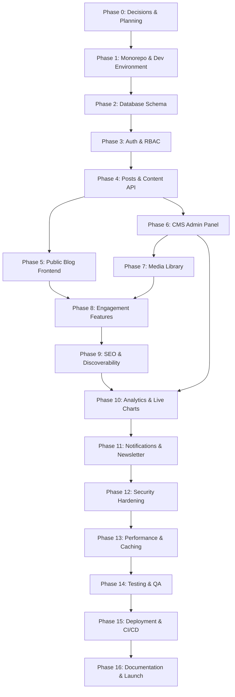

# Project Workflow & Todo List

Complete development workflow for the Personal Blog Platform with CMS Backend & Live Data Dashboard.

**Related docs:** [`projectDetails.md`](../projectDetails.md) · [`architecture.md`](./architecture.md)

---

## How to Use This Document

1. Work **top to bottom** within each phase — later tasks depend on earlier ones.
2. Do not skip **Phase Gates** — they confirm a phase is stable before moving on.
3. Mark items `[x]` when done, `[ ]` when pending, `[-]` when in progress.
4. One feature slice = **API → shared types → frontend → test** before starting the next slice.
5. Keep `main` deployable; use feature branches per phase or major task group.

### Status Legend

| Mark  | Meaning            |
| ----- | ------------------ |
| `[ ]` | Not started        |
| `[-]` | In progress        |
| `[x]` | Completed          |
| `[~]` | Blocked / deferred |

---

## Workflow Overview



**Estimated timeline:** 8–10 weeks (solo developer, part-time adjust accordingly)

---

## Phase 0: Decisions & Planning

> **Goal:** Lock architecture choices and define scope before writing code.

### 0.1 Confirm architecture decisions

- [x] Confirm monorepo approach (Turborepo)
- [x] Confirm stack: Next.js 15, NestJS, Prisma, PostgreSQL, Redis
- [x] Confirm hosting strategy (container-friendly and provider-neutral until production deployment)
- [x] Confirm object storage provider (MinIO locally; S3-compatible provider in production)
- [x] Confirm chart library (Recharts)
- [x] Document architecture decisions and MVP scope in `docs/ADR.md`

### 0.2 Define MVP scope

- [x] List **must-have** features for v1 launch
- [x] List **nice-to-have** features deferred to post-launch
- [x] Explicitly defer: 2FA, OAuth (unless required for launch), AI features, mobile apps, PWA
- [x] Define default admin account seed strategy

### 0.3 Project setup (non-code)

- [x] Create GitHub repository and connect it as `origin`
- [x] Define branch strategy (`main` + feature branches)
- [x] Choose GitHub Issues and GitHub Projects for project management
- [~] Set up local prerequisites: Node.js 20+, Docker, pnpm/npm, Git (Docker Compose is not installed)

### Phase 0 Gate

- [x] Architecture decisions documented and agreed
- [x] MVP scope written down (what ships vs what waits)
- [x] Repository exists locally and is connected to GitHub

---

## Phase 1: Monorepo & Development Environment

> **Goal:** Runnable local dev environment with all apps and services wired together.

### 1.1 Initialize monorepo

- [x] Scaffold Turborepo root (`package.json`, `turbo.json`, workspace config)
- [x] Create `apps/web` — Next.js 15 App Router + TypeScript
- [x] Create `apps/api` — NestJS + TypeScript
- [x] Create `packages/database` — Prisma package
- [x] Create `packages/shared` — shared types, enums, constants
- [x] Create `packages/config` — ESLint, Prettier, TypeScript base configs
- [x] Configure path aliases and workspace dependencies
- [x] Add root scripts: `dev`, `build`, `lint`, `test`, `db:migrate`

### 1.2 Docker & local services

- [x] Create `docker/docker-compose.yml`
- [x] Add PostgreSQL 16 service with persistent volume
- [x] Add Redis service
- [x] Add MinIO service (S3-compatible local storage)
- [x] Add health checks for all services
- [x] Create `.env.example` with all required variables
- [x] Create local `.env` (never commit)

### 1.3 App bootstrapping

- [x] Configure NestJS: global prefix `/api/v1`, CORS, validation pipe, exception filter
- [x] Configure Next.js: route groups `(public)`, `(auth)`, `(admin)`
- [x] Install and configure Tailwind CSS in `apps/web`
- [x] Install shadcn/ui and set up base theme tokens
- [x] Add dark/light mode provider (next-themes)
- [x] Verify `pnpm dev` starts web + api concurrently
- [x] Verify API health endpoint: `GET /api/v1/health`
- [x] Verify web home page renders

### 1.4 Developer experience

- [x] Configure ESLint + Prettier across all packages
- [x] Configure Husky + lint-staged (pre-commit hooks)
- [x] Add `.gitignore` (node_modules, .env, dist, .turbo)
- [~] Add VS Code recommended extensions / settings (optional; deferred)
- [x] Write short `README.md` with local setup steps

### Phase 1 Gate

- [~] `docker compose up` starts Postgres, Redis, MinIO without errors (Docker Compose is unavailable in this environment)
- [x] `pnpm dev` runs web (port 3000) and api (port 4000) simultaneously
- [x] Health check passes on both apps

---

## Phase 2: Database Schema & Migrations

> **Goal:** Complete Prisma schema covering all core entities; migrations run cleanly.

### 2.1 Identity & access models

- [x] Define `User` model (email, password hash, profile fields, status)
- [x] Define `Role` model (admin, editor, author, subscriber)
- [x] Define `Permission` model (granular: `posts:create`, etc.)
- [x] Define `RolePermission` join table
- [x] Define `Session` model (refresh token tracking)
- [x] Define `AuditLog` model (actor, action, resource, metadata, IP)

### 2.2 Content models

- [x] Define `Post` model (title, slug, content, excerpt, status, publishedAt, scheduledAt)
- [x] Define `Category` model (name, slug, description)
- [x] Define `Tag` model (name, slug)
- [x] Define `PostTag` join table
- [x] Define `Comment` model (threaded via parentId, moderation status)
- [x] Define `Media` model (filename, mimeType, size, url, storageKey, altText)

### 2.3 Engagement models

- [x] Define `Bookmark` model (userId + postId unique)
- [x] Define `ReadingHistory` model (userId, postId, lastReadAt, progress)
- [x] Define `NewsletterSubscriber` model (email, status, subscribedAt)

### 2.4 Analytics models

- [x] Define `AnalyticsEvent` model (eventType, userId?, postId?, metadata JSON, createdAt)
- [x] Define `AnalyticsDailyAggregate` model (date, metric, value, dimensions JSON)
- [x] Define `ChartDataset` model (name, type, source, config JSON)
- [x] Define `ChartDataPoint` model (datasetId, label, value, timestamp)

### 2.5 System models

- [x] Define `Setting` model (key-value site configuration)
- [x] Define `Notification` model (userId, type, content, readAt)

### 2.6 Schema hardening

- [x] Add indexes: `posts(slug)`, `posts(status, publishedAt)`, `analytics_events(createdAt, eventType)`
- [x] Add unique constraints where needed (slugs, emails)
- [x] Add cascading delete rules (e.g. comments on post delete)
- [x] Add `onDelete` / `onUpdate` relations explicitly
- [x] Run initial migration: `prisma migrate dev --name init`
- [x] Create seed script: default roles, permissions, admin user, sample categories
- [x] Verify seed runs: `pnpm db:seed`

### Phase 2 Gate

- [x] All models migrate without errors
- [x] Seed creates admin user + 4 roles + base permissions
- [x] Prisma Client generates and is importable from `packages/database`

---

## Phase 3: Authentication & Authorization

> **Goal:** Secure login/register, JWT flow, RBAC guards on all protected routes.

### 3.1 Auth module (NestJS)

- [x] Implement password hashing (bcrypt / argon2)
- [x] Implement `POST /auth/register` (subscriber role by default)
- [x] Implement `POST /auth/login` (returns access token)
- [x] Implement refresh token flow with HTTP-only cookie
- [x] Store refresh token JTI in Redis with TTL
- [x] Implement `POST /auth/refresh`
- [x] Implement `POST /auth/logout` (invalidate refresh token)
- [x] Implement `GET /auth/me` (current user + role + permissions)

### 3.2 Guards & decorators

- [x] Create `@Public()` decorator for unauthenticated routes
- [x] Create `@Roles()` decorator
- [x] Create `@Permissions()` decorator
- [x] Implement `JwtAuthGuard`
- [x] Implement `RolesGuard`
- [x] Implement `PermissionsGuard`
- [x] Apply guards globally; mark public routes explicitly

### 3.3 Auth frontend (Next.js)

- [x] Build `/login` page
- [x] Build `/register` page
- [x] Implement auth context / session hook
- [x] Configure API client with token refresh interceptor
- [x] Add Next.js middleware to protect `(admin)` and `(auth)` routes
- [x] Redirect unauthenticated users from `/admin/*` to `/login`
- [x] Redirect authenticated users away from `/login` to `/admin`

### 3.4 User module (basic)

- [x] Implement `GET /users/me`
- [x] Implement `PATCH /users/me` (profile update)
- [x] Implement password change endpoint
- [x] Build `/profile` page (view + edit)

### Phase 3 Gate

- [x] Register → login → access protected route works end-to-end
- [x] Admin role can access `/admin`; subscriber cannot
- [x] Refresh token rotation works; logout invalidates session
- [x] Invalid/expired tokens return 401 consistently

---

## Phase 4: Posts & Content API

> **Goal:** Full post lifecycle via API — draft, publish, schedule, categorize, tag.

### 4.1 Categories & tags module

- [x] `GET /categories` — public list
- [x] `GET /tags` — public list
- [x] Admin CRUD: `POST/PATCH/DELETE /admin/categories`
- [x] Admin CRUD: `POST/PATCH/DELETE /admin/tags`
- [x] Slug auto-generation utility (unique, URL-safe)

### 4.2 Posts module — public endpoints

- [x] `GET /posts` — paginated, filter by category/tag/status=published
- [x] `GET /posts/:slug` — single published post
- [x] `GET /posts/featured` — featured posts
- [x] `GET /posts/trending` — trending logic (views or recent engagement)
- [x] `GET /posts/:slug/related` — related by category/tags

### 4.3 Posts module — admin endpoints

- [x] `GET /admin/posts` — all statuses, paginated, searchable
- [x] `GET /admin/posts/:id` — single post (any status)
- [x] `POST /admin/posts` — create draft
- [x] `PATCH /admin/posts/:id` — update
- [x] `DELETE /admin/posts/:id` — soft or hard delete
- [x] `POST /admin/posts/:id/publish` — publish immediately
- [x] `POST /admin/posts/:id/schedule` — set scheduledAt
- [x] Enforce author can only edit own posts; editor/admin can edit all

### 4.4 Shared types & validation

- [x] Define DTOs in `packages/shared`: CreatePostDto, UpdatePostDto, PostResponse
- [x] Add validation: title required, slug unique, content min length
- [x] Add post status enum: DRAFT, SCHEDULED, PUBLISHED, ARCHIVED

### 4.5 Scheduled publishing (background job)

- [x] Set up BullMQ in NestJS
- [x] Create scheduled publish job (runs every minute)
- [x] Publish posts where `scheduledAt <= now` and status = SCHEDULED
- [x] Log publish events to audit log

### Phase 4 Gate

- [x] Admin can create, edit, publish, and schedule posts via API
- [x] Public API returns only published posts
- [x] Scheduled posts auto-publish when due
- [x] RBAC enforced on all admin post routes

---

## Phase 5: Public Blog Frontend

> **Goal:** Visitor-facing blog — fast, responsive, SEO-friendly pages.

### 5.1 Layout & design system

- [x] Build public layout: header, footer, navigation
- [x] Build responsive mobile navigation
- [x] Create reusable components: PostCard, CategoryBadge, TagList, Pagination
- [x] Apply typography scale and reading-optimized article layout
- [x] Verify dark/light mode on all public pages

### 5.2 Core pages

- [x] **Home (`/`)** — featured, latest, trending sections, category grid
- [x] **Blog listing (`/blog`)** — paginated post grid with filters
- [x] **Article page (`/blog/[slug]`)** — SSR/ISR, rich content render, author, date
- [x] **Category page (`/category/[slug]`)**
- [x] **Tag page (`/tag/[slug]`)**
- [x] **Author page (`/author/[slug]`)** — bio + post list

### 5.3 Home page features

- [x] Featured articles section (from API)
- [x] Latest posts section
- [x] Trending posts section
- [x] Categories showcase
- [x] Newsletter subscription form (UI only — wire in Phase 11)

### 5.4 Article page features

- [x] Render rich HTML/Markdown content safely
- [x] Display tags and category
- [x] Show author profile snippet
- [x] Related posts section
- [x] Social share buttons (Twitter/X, LinkedIn, copy link)
- [~] Reading progress indicator (optional)

### 5.5 Search

- [x] Build `/search` page with query input
- [x] Implement `GET /search?q=` API (PostgreSQL full-text search)
- [x] Display search results with highlighting
- [x] Handle empty results state

### 5.6 Performance (initial)

- [x] Configure ISR revalidation on home and listing pages
- [x] Add `generateMetadata` for article pages (title, description)
- [x] Lazy load below-fold images
- [~] Verify Lighthouse score baseline (target > 80 performance)

### Phase 5 Gate

- [x] All public routes render with real API data
- [x] Article pages work with SSR/ISR
- [x] Mobile layout verified at 375px width
- [x] Search returns relevant results

---

## Phase 6: CMS Admin Panel

> **Goal:** Full admin UI for content management, user overview, and site control.

### 6.1 Admin shell

- [x] Build admin layout: sidebar navigation, top bar, breadcrumbs
- [x] Admin nav items: Dashboard, Posts, Media, Categories, Tags, Users, SEO, Analytics, Settings
- [x] Role-based nav visibility (hide Users from non-admin)
- [x] Admin dashboard placeholder page

### 6.2 Posts management UI

- [x] **Posts list (`/admin/posts`)** — table with status, author, date, actions
- [x] Filters: status, category, author, date range
- [~] Bulk actions: publish, archive, delete
- [x] **Post editor (`/admin/posts/new`, `/admin/posts/[id]/edit`)**
- [x] Integrate rich text editor (TipTap or similar)
- [x] Title, slug (auto-gen), excerpt, featured image selector
- [x] Category and tag multi-select
- [x] Status controls: save draft, publish, schedule (date picker)
- [x] Preview mode (opens public URL or inline preview)

### 6.3 Categories & tags UI

- [x] `/admin/categories` — CRUD table + modal form
- [x] `/admin/tags` — CRUD table + modal form

### 6.4 User management UI (admin only)

- [x] `/admin/users` — user list with role, status, last login
- [x] Create user / invite flow
- [x] Edit role assignment
- [x] Deactivate / activate user

### 6.5 Settings UI

- [x] `/admin/settings` — site name, description, logo URL, social links
- [x] Persist via Settings API

### 6.6 TanStack Query setup

- [x] Configure QueryClient in admin layout
- [x] Add query hooks: `usePosts`, `usePost`, `useCategories`, etc.
- [x] Add mutation hooks with optimistic updates where appropriate
- [x] Toast notifications for success/error states

### Phase 6 Gate

- [x] Admin can manage full post lifecycle without using API directly
- [x] Rich text editor saves and renders content correctly
- [x] Non-admin roles see appropriate UI restrictions
- [x] All admin forms validate before submit

---

## Phase 7: Media Library

> **Goal:** Upload, store, browse, and attach media from admin and editor.

### 7.1 Storage integration

- [x] Configure S3/R2/MinIO client in NestJS
- [x] Implement presigned upload URL generation
- [x] Implement `POST /admin/media/upload` (direct or presigned flow)
- [x] Store metadata in `Media` table after upload
- [x] Implement file type validation (images, video, documents)
- [x] Implement file size limits

### 7.2 Media API

- [x] `GET /admin/media` — paginated library with filters (type, date)
- [x] `GET /admin/media/:id`
- [x] `PATCH /admin/media/:id` — update alt text, caption
- [x] `DELETE /admin/media/:id` — remove from storage + DB

### 7.3 Media UI

- [x] `/admin/media` — grid/list view with thumbnails
- [x] Upload dropzone (drag & drop + file picker)
- [x] Upload progress indicator
- [x] Media detail panel (preview, alt text, URL copy, delete)
- [x] Media picker modal (used in post editor for featured image + inline)

### 7.4 Media optimization

- [x] Generate image thumbnails on upload (sharp)
- [x] Store width/height metadata
- [x] Serve images via Next.js `<Image>` with remote pattern config
- [~] Add WebP conversion (optional for v1)

### Phase 7 Gate

- [x] Upload image → appears in library → attach to post → renders on public site
- [x] Invalid file types rejected with clear error
- [x] Delete removes file from storage and DB

---

## Phase 8: Engagement Features

> **Goal:** Comments, bookmarks, reading history, and user-facing interactivity.

### 8.1 Comments

- [x] `GET /comments?postId=` — public, approved only
- [x] `POST /comments` — authenticated users
- [x] `PATCH /admin/comments/:id` — approve/reject/edit
- [x] `DELETE /admin/comments/:id`
- [x] Support threaded replies (parentId)
- [x] Rate limit comment submission
- [x] Build comment section UI on article page
- [x] Build comment moderation UI in admin

### 8.2 Bookmarks

- [x] `GET /bookmarks` — user's saved posts
- [x] `POST /bookmarks` — add bookmark
- [x] `DELETE /bookmarks/:postId` — remove
- [x] Bookmark toggle button on article page
- [x] `/bookmarks` page for logged-in users

### 8.3 Reading history

- [x] Track page view on article read (authenticated)
- [x] `GET /reading-history` — user's recent reads
- [x] `/history` page for logged-in users
- [x] Optional: reading progress percentage

### 8.4 Author profiles (public)

- [x] Author bio field on User model (if not already)
- [x] Public author page with avatar, bio, social links, posts

### Phase 8 Gate

- [x] Logged-in user can comment, bookmark, and view history
- [x] Admin can moderate comments
- [x] Guest users can read comments but not post

---

## Phase 9: SEO & Discoverability

> **Goal:** Search-engine-ready site with proper metadata, sitemaps, and URL management.

### 9.1 Meta & Open Graph

- [x] Per-post meta title and description fields (admin editor)
- [x] `generateMetadata` on all public pages using post/site settings
- [x] Open Graph tags: og:title, og:description, og:image, og:url
- [x] Twitter Card tags
- [x] Canonical URLs on article pages

### 9.2 SEO module (API)

- [x] `GET /sitemap.xml` — dynamic sitemap (posts, categories, tags, authors)
- [x] `GET /robots.txt`
- [x] Admin: edit default meta templates in SEO settings
- [x] Admin: `/admin/seo` — overview of posts missing meta description

### 9.3 URL management

- [x] Slug uniqueness validation with helpful errors
- [x] Redirect old slug → new slug on post slug change (301)
- [x] Store slug history for redirects (optional)

### 9.4 Structured data

- [x] JSON-LD `Article` schema on blog posts
- [x] JSON-LD `WebSite` schema on home page
- [x] Validate with Google Rich Results Test

### Phase 9 Gate

- [x] `/sitemap.xml` and `/robots.txt` accessible
- [x] Article pages pass basic OG preview (Facebook/Twitter debugger)
- [x] No published post missing meta description (admin warning shown)

---

## Phase 10: Analytics & Live Charts

> **Goal:** Track visitor behavior, aggregate data, and display real-time dashboards in admin.

### 10.1 Event tracking

- [x] Implement `POST /analytics/events` — public, rate-limited
- [x] Event types: `page_view`, `post_view`, `search`, `signup`, `comment`
- [x] Client-side tracker hook in Next.js public layout
- [x] Capture: path, postId, referrer, userAgent, sessionId (anonymous)
- [x] Batch events client-side to reduce API calls (optional)

### 10.2 Aggregation pipeline

- [x] BullMQ job: hourly aggregation → `AnalyticsDailyAggregate`
- [x] Metrics: total page views, unique visitors (session), top posts, top categories
- [x] BullMQ job: daily roll-up for monthly statistics
- [x] Cache aggregated results in Redis (TTL 5 min)

### 10.3 Analytics API (admin)

- [x] `GET /admin/analytics/overview` — summary cards (today, week, month)
- [x] `GET /admin/analytics/traffic` — time series data
- [x] `GET /admin/analytics/popular-posts` — bar chart data
- [x] `GET /admin/analytics/categories` — pie chart data
- [x] `GET /admin/analytics/engagement` — comments, bookmarks, signups

### 10.4 Real-time WebSocket

- [x] Implement WebSocket gateway in NestJS (`/ws/analytics`)
- [x] Push live page view count to connected admin clients
- [x] Use Redis pub/sub to fan out events across API instances
- [x] Authenticate WebSocket connections (admin only)

### 10.5 Chart datasets (custom)

- [x] Admin CRUD for `ChartDataset` and `ChartDataPoint`
- [x] Support manual data entry and CSV import
- [x] Support external API URL as data source (fetch + cache)
- [x] `GET /admin/chart-datasets/:id/data`

### 10.6 Admin dashboard UI

- [x] `/admin` dashboard — overview stat cards
- [x] Line chart: traffic over time (Recharts)
- [x] Bar chart: popular posts
- [x] Pie chart: traffic by category
- [x] Area chart: engagement metrics
- [x] Live indicator on real-time page view counter
- [x] Date range selector (7d, 30d, 90d, custom)
- [x] `/admin/analytics` — full analytics page with all charts
- [~] Custom chart builder UI (basic)

### Phase 10 Gate

- [x] Page views recorded when visiting public pages
- [x] Admin dashboard shows accurate aggregated data
- [x] WebSocket updates live view count without page refresh
- [x] At least 4 chart types render with real data

---

## Phase 11: Notifications & Newsletter

> **Goal:** Keep users and admin informed; grow audience via newsletter.

### 11.1 Newsletter

- [~] `POST /newsletter/subscribe` — public, double opt-in optional
- [x] Store in `NewsletterSubscriber` table
- [x] Wire home page newsletter form to API
- [x] Admin: `/admin/newsletter` — subscriber list, export CSV
- [x] Unsubscribe endpoint + page

### 11.2 In-app notifications

- [x] `GET /notifications` — user's notifications
- [x] `PATCH /notifications/:id/read`
- [x] Create notifications on: comment reply, post published (for authors)
- [x] Notification bell in header (logged-in users)

### 11.3 Email (optional for v1)

- [x] Configure email provider (Resend / SendGrid / SMTP)
- [x] Send welcome email on register
- [x] Send newsletter confirmation email
- [~] Send new post notification to subscribers (manual trigger from admin)

### Phase 11 Gate

- [x] Newsletter signup works from home page
- [x] Admin can view subscriber list
- [x] In-app notifications appear for comment replies

---

## Phase 12: Security Hardening

> **Goal:** Production-grade security before launch.

### 12.1 API security

- [x] Rate limiting on all public endpoints (Redis-backed)
- [x] Stricter rate limits on auth endpoints (login, register)
- [x] Request size limits (body parser config)
- [x] Helmet.js security headers
- [x] CORS whitelist for production domains only

### 12.2 Input sanitization

- [x] Sanitize rich text HTML on save (DOMPurify server-side)
- [x] Validate and sanitize all DTO inputs
- [x] Escape user content in API responses where needed

### 12.3 CSRF & cookies

- [x] SameSite=Strict on refresh cookie
- [x] Secure flag on cookies in production
- [~] CSRF protection for cookie-based mutations (if applicable)

### 12.4 Audit & logging

- [x] Audit log interceptor on all admin mutations
- [x] Log: login, logout, failed login attempts
- [x] Admin: `/admin/audit-logs` — searchable log viewer
- [x] Structured logging (JSON) for production

### 12.5 OAuth (post-MVP or if required)

- [x] Google OAuth via Passport
- [x] GitHub OAuth via Passport
- [x] Link OAuth account to existing user

### 12.6 Two-factor authentication (deferred)

- [~~] [~~] TOTP 2FA — defer unless explicitly required for launch

### Phase 12 Gate

- [x] Rate limiting blocks excessive requests
- [x] XSS test: script tags in comments/posts are sanitized
- [x] All admin actions appear in audit log
- [x] Security headers present in production responses

---

## Phase 13: Performance & Caching

> **Goal:** Fast page loads, efficient API, and scalable caching layer.

### 13.1 Redis caching

- [x] Cache published posts list (TTL 60s, invalidate on publish)
- [x] Cache single post by slug (TTL 5m, invalidate on edit)
- [x] Cache categories/tags (TTL 1h)
- [x] Cache analytics overview (TTL 5m)
- [x] Implement cache-aside pattern in NestJS service layer

### 13.2 Frontend performance

- [~] Audit and optimize bundle size (analyze with `@next/bundle-analyzer`)
- [x] Code-split admin routes (separate from public bundle)
- [x] Optimize images: Next.js Image, proper sizes, priority on LCP
- [x] Font optimization (next/font)
- [~] Prefetch linked posts on hover (optional)

### 13.3 Database performance

- [x] Review slow query log
- [x] Add missing indexes based on query patterns
- [x] Pagination on all list endpoints (cursor or offset)
- [x] Avoid N+1 queries (Prisma `include` / dataloader pattern)

### 13.4 CDN & static assets

- [~] Serve media via CDN (Cloudflare / R2 public URL)
- [x] Configure cache headers on static assets
- [~] Enable gzip/brotli compression

### Phase 13 Gate

- [~] Lighthouse Performance score ≥ 90 on home and article pages
- [x] API list endpoints respond < 200ms with cache warm
- [x] No N+1 query warnings in dev logs

---

## Phase 14: Testing & Quality Assurance

> **Goal:** Confidence in core flows before production deployment.

### 14.1 Backend tests

- [x] Unit tests: auth service (login, token refresh, password hash)
- [x] Unit tests: posts service (CRUD, publish, schedule, RBAC)
- [x] Unit tests: analytics aggregation logic
- [x] Integration tests: auth flow (register → login → protected route)
- [x] Integration tests: post publish flow
- [x] Integration tests: comment moderation flow

### 14.2 Frontend tests

- [x] Component tests: PostCard, CommentSection, AdminPostForm
- [x] E2E (Playwright): public blog browse flow
- [x] E2E: admin login → create post → publish → view on public site
- [x] E2E: user register → bookmark → view bookmarks

### 14.3 Manual QA checklist

- [x] All public pages on mobile (375px) and desktop (1280px)
- [x] Dark mode on all pages
- [x] Admin RBAC: test as admin, editor, author, subscriber
- [x] Scheduled post publishes on time
- [x] 404 page for invalid slugs
- [x] Error boundaries on frontend
- [x] API returns proper error codes (400, 401, 403, 404, 429, 500)

### Phase 14 Gate

- [x] All critical E2E tests pass
- [x] No P0/P1 bugs open
- [x] Manual QA checklist completed

---

## Phase 15: Deployment & CI/CD

> **Goal:** Automated, repeatable deployments to production.

### 15.1 Containerization

- [x] Write `Dockerfile` for NestJS API
- [x] Write `Dockerfile` for Next.js (or use Vercel)
- [x] Production `docker-compose.prod.yml` (optional for VPS)
- [x] Multi-stage builds for minimal image size

### 15.2 CI pipeline (GitHub Actions)

- [x] Workflow: lint + typecheck on every PR
- [x] Workflow: run unit + integration tests on every PR
- [x] Workflow: build web + api on merge to main
- [x] Workflow: run Prisma migrations on deploy
- [x] Block merge if CI fails

### 15.3 Production infrastructure

- [x] Provision PostgreSQL (Neon / DigitalOcean / RDS)
- [x] Provision Redis (Upstash / DO Managed Redis)
- [x] Provision object storage (R2 / S3) with public read bucket
- [x] Deploy Next.js to Vercel (or VPS)
- [x] Deploy NestJS API to Fly.io / Railway / VPS
- [x] Configure custom domain + SSL (Cloudflare)
- [x] Set all production environment variables

### 15.4 Production checklist

- [x] HTTPS enforced on all routes
- [x] Database connection pooling configured
- [x] Automated daily database backups
- [x] Error monitoring (Sentry or similar)
- [~] Uptime monitoring (UptimeRobot / Better Stack)
- [~] Log aggregation accessible

### Phase 15 Gate

- [x] Production URL loads public blog
- [x] Admin panel accessible at production `/admin`
- [x] CI/CD deploys on push to main without manual steps
- [x] Backups verified restorable

---

## Phase 16: Documentation & Launch

> **Goal:** Ship with documentation; project is handoff-ready.

### 16.1 Technical documentation

- [x] Update root `README.md`: overview, setup, scripts, env vars
- [x] API documentation (Swagger/OpenAPI via NestJS)
- [x] Database schema diagram (export from Prisma or Mermaid)
- [x] Deployment runbook (how to deploy, rollback, migrate)
- [x] Environment variables reference (all vars documented)

### 16.2 User documentation

- [x] Admin user guide: how to create/publish posts
- [x] Admin user guide: media library, SEO, analytics dashboard
- [x] FAQ: common admin tasks

### 16.3 Launch preparation

- [x] Seed production with initial content (at least 3 posts)
- [x] Verify sitemap submitted to Google Search Console
- [~] Verify OG previews on social platforms
- [x] Final security review
- [~] Create v1.0.0 git tag
- [~] Announce launch 🚀

### Phase 16 Gate

- [x] All deliverables from `projectDetails.md` checked off
- [x] Documentation sufficient for another developer to run locally
- [x] Site live on production domain

---

## Future Enhancements Backlog

> Not in v1 scope — track here for later phases.

- [ ] AI-powered content recommendations
- [ ] AI writing assistant in post editor
- [ ] Email marketing integration (Mailchimp, ConvertKit)
- [ ] Membership subscriptions and paywall
- [ ] Online courses module
- [ ] Podcast hosting
- [ ] Video blogging
- [ ] E-commerce integration
- [ ] Native mobile apps (iOS & Android)
- [ ] Multi-language / i18n support
- [ ] Progressive Web App (PWA)
- [ ] Two-factor authentication (2FA)
- [ ] Revenue tracking in analytics
- [ ] Meilisearch for advanced search
- [ ] TimescaleDB / ClickHouse if analytics scale demands it

---

## Milestone Summary

| Milestone | Phase       | Key deliverable              | Target    |
| --------- | ----------- | ---------------------------- | --------- |
| **M0**    | Phase 0     | Decisions locked, repo ready | Week 0    |
| **M1**    | Phase 1–2   | Dev environment + DB schema  | Week 1    |
| **M2**    | Phase 3–4   | Auth + Posts API complete    | Week 2    |
| **M3**    | Phase 5     | Public blog live locally     | Week 3    |
| **M4**    | Phase 6–7   | CMS admin + media library    | Week 4–5  |
| **M5**    | Phase 8–9   | Engagement + SEO complete    | Week 6    |
| **M6**    | Phase 10    | Analytics dashboard live     | Week 7    |
| **M7**    | Phase 11–13 | Newsletter + security + perf | Week 8    |
| **M8**    | Phase 14–16 | Tested, deployed, documented | Week 9–10 |

---

## Quick Reference: Build Order for Any Feature

When adding any new feature, always follow this order:

```
1. Prisma model (+ migration if needed)
2. Shared types/DTOs in packages/shared
3. NestJS module: service → controller → guards
4. API manual test (curl / Postman / Swagger)
5. Next.js UI consuming the API
6. TanStack Query hooks (admin) or SSR fetch (public)
7. Unit/integration test for critical path
8. Update this TODO.md checklist
```

---

_Last updated: July 2026_
