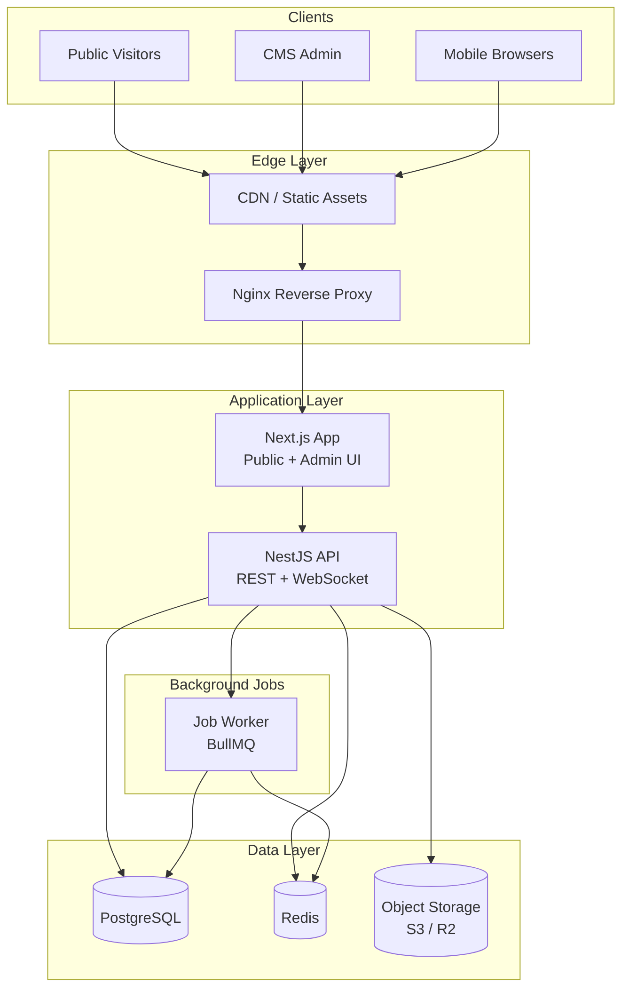
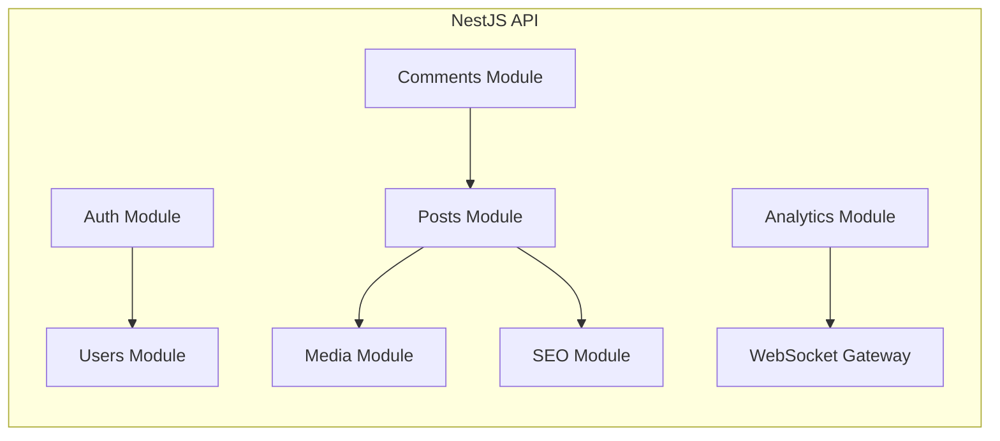
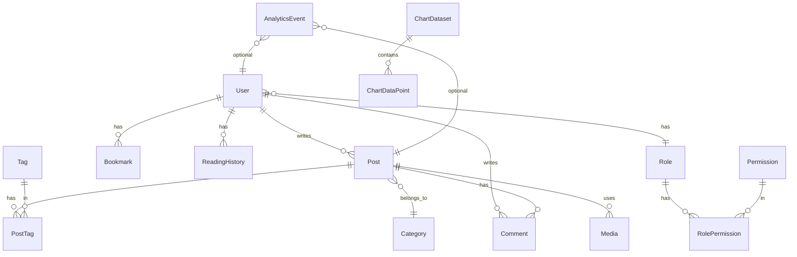
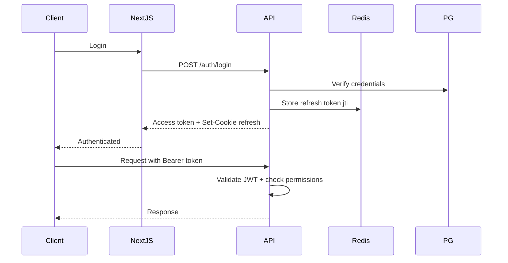
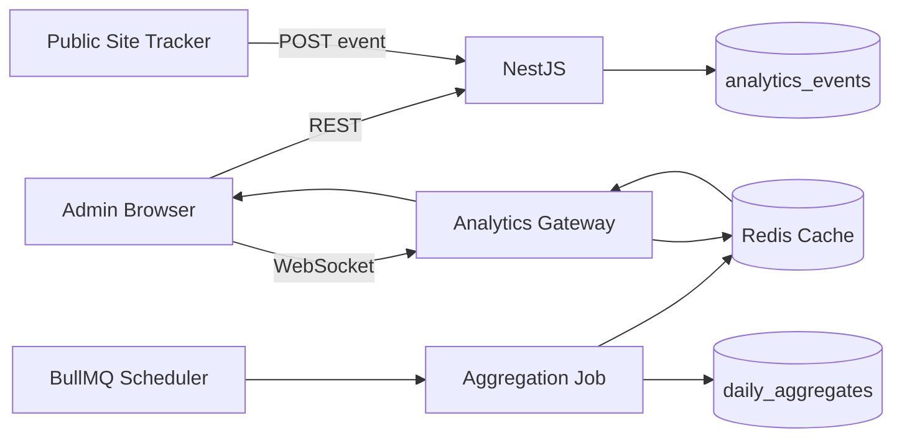

# Architecture Design: Personal Blog Platform

This document defines the system architecture for the personal blog platform with CMS backend and live analytics dashboard, aligned with the requirements in `projectDetails.md`.

---

## 1. Architectural Principles

| Principle                  | Decision                                                                            |
| -------------------------- | ----------------------------------------------------------------------------------- |
| **Separation of concerns** | Public blog, CMS admin, and API are distinct layers with shared domain logic        |
| **API-first**              | Backend owns business rules; frontend consumes REST (GraphQL optional later)        |
| **SSR for SEO**            | Next.js App Router for public pages; client-heavy admin dashboard                   |
| **Single source of truth** | PostgreSQL for relational data; Redis for cache/sessions/real-time fan-out          |
| **Progressive complexity** | Start with PostgreSQL analytics tables; add dedicated time-series DB only if needed |
| **Security by default**    | RBAC, JWT + refresh tokens, rate limiting, audit logs from day one                  |

---

## 2. High-Level System Architecture



**Request flow:**

- Public pages: Next.js SSR/ISR → NestJS API (or direct DB reads for static content)
- CMS: Next.js admin routes (protected) → NestJS API with RBAC
- Live charts: WebSocket/SSE from NestJS, fed by Redis pub/sub + PostgreSQL aggregates
- Media: Upload to NestJS → store in S3/R2 → serve via CDN

---

## 3. Recommended Tech Stack (Concrete Choices)

| Layer                 | Choice                                                 | Why                                                |
| --------------------- | ------------------------------------------------------ | -------------------------------------------------- |
| **Monorepo**          | Turborepo                                              | Shared types, one repo, parallel builds            |
| **Public + Admin UI** | Next.js 15 (App Router) + TypeScript                   | SSR, SEO, route groups for `(public)` vs `(admin)` |
| **Styling**           | Tailwind CSS + shadcn/ui                               | Fast, consistent CMS UI                            |
| **Charts**            | Recharts (admin) + lightweight client charts on public | React-native, good for dashboards                  |
| **API**               | NestJS + TypeScript                                    | Modules, guards, decorators fit RBAC well          |
| **ORM**               | Prisma                                                 | Type-safe schema, migrations, PostgreSQL-first     |
| **Primary DB**        | PostgreSQL 16                                          | Posts, users, RBAC, comments, settings             |
| **Cache / Sessions**  | Redis                                                  | Cache, rate limits, WebSocket fan-out, job queues  |
| **Job queue**         | BullMQ (Redis-backed)                                  | Scheduled posts, sitemap, analytics aggregation    |
| **Auth**              | JWT access + HTTP-only refresh cookie                  | Stateless API + secure session rotation            |
| **OAuth**             | Google + GitHub via Passport                           | Phase 2                                            |
| **Search**            | PostgreSQL full-text search                            | Simple start; Meilisearch later if needed          |
| **Media**             | Cloudflare R2 or AWS S3                                | Scalable, CDN-friendly                             |
| **Deploy**            | Docker Compose (dev) → VPS/DO or Vercel + Railway/Fly  | Flexible, cost-effective                           |

**Defer for now:** MongoDB (PostgreSQL + time-series tables is enough initially), GraphQL, 2FA (add in phase 3).

---

## 4. Monorepo Structure

```
blog-app/
├── apps/
│   ├── web/                    # Next.js (public blog + admin UI)
│   │   ├── app/
│   │   │   ├── (public)/       # Home, blog, categories, search
│   │   │   ├── (auth)/         # Login, register, profile
│   │   │   └── (admin)/        # CMS dashboard (RBAC protected)
│   │   └── components/
│   └── api/                    # NestJS REST + WebSocket gateway
│       └── src/
│           ├── modules/
│           │   ├── auth/
│           │   ├── users/
│           │   ├── posts/
│           │   ├── media/
│           │   ├── comments/
│           │   ├── analytics/
│           │   ├── seo/
│           │   └── notifications/
│           └── common/         # Guards, filters, interceptors
├── packages/
│   ├── database/               # Prisma schema + client
│   ├── shared/                 # DTOs, enums, types, validators
│   └── config/                 # ESLint, TS, Tailwind presets
├── docker/
│   ├── docker-compose.yml      # postgres, redis, minio (local S3)
│   └── Dockerfile.api
├── docs/
│   └── architecture.md
└── turbo.json
```

---

## 5. Frontend Architecture (Next.js)

### Route groups

```
(public)/
  /                     → Home (featured, latest, trending)
  /blog                 → Post listing
  /blog/[slug]          → Article (SSR/ISR)
  /category/[slug]
  /tag/[slug]
  /author/[slug]
  /search

(auth)/
  /login, /register
  /profile, /bookmarks, /history

(admin)/
  /admin                → Dashboard + live charts
  /admin/posts
  /admin/media
  /admin/users
  /admin/seo
  /admin/analytics
  /admin/settings
```

### Rendering strategy

| Page type       | Strategy             | Cache                           |
| --------------- | -------------------- | ------------------------------- |
| Home, listings  | ISR (revalidate 60s) | CDN + Redis                     |
| Article pages   | ISR per slug         | Long TTL, invalidate on publish |
| Admin dashboard | Client-side (CSR)    | No cache                        |
| Search          | SSR or client fetch  | Short cache                     |

### State management

- **Server state:** TanStack Query for API data in admin and user features
- **UI state:** React context for theme (dark/light)
- **Auth:** HTTP-only refresh cookie + in-memory access token (or Next.js middleware session check)

---

## 6. Backend Architecture (NestJS Modules)



### Module responsibilities

| Module            | Responsibility                                                   |
| ----------------- | ---------------------------------------------------------------- |
| **Auth**          | Login, register, JWT, refresh, OAuth hooks, session invalidation |
| **Users**         | Profiles, roles, permissions, bookmarks, reading history         |
| **Posts**         | CRUD, drafts, scheduling, categories, tags, related posts        |
| **Media**         | Upload, optimization metadata, S3 presigned URLs                 |
| **Comments**      | Threaded comments, moderation, spam protection                   |
| **Analytics**     | Event ingestion, aggregation, chart data APIs                    |
| **SEO**           | Meta, sitemap.xml, robots.txt, OG image generation               |
| **Notifications** | In-app + email queue (newsletter, publish alerts)                |

### Cross-cutting concerns

- **Guards:** `JwtAuthGuard`, `RolesGuard`, `PermissionsGuard`
- **Interceptors:** Response transform, audit logging
- **Filters:** Global exception handler
- **Pipes:** Validation via `class-validator`

---

## 7. Database Architecture

### Entity relationship (core)



### Core tables (PostgreSQL)

**Identity & access**

- `users`, `roles`, `permissions`, `role_permissions`, `sessions`, `audit_logs`

**Content**

- `posts`, `categories`, `tags`, `post_tags`, `comments`, `media`

**User engagement**

- `bookmarks`, `reading_history`, `newsletter_subscribers`

**Analytics**

- `analytics_events` (raw events: page_view, click, signup)
- `analytics_daily_aggregates` (pre-computed: date, metric, value)
- `chart_datasets`, `chart_data_points` (custom/API-driven charts)

**System**

- `settings`, `notifications`

### Analytics data strategy

```
Visitor action → API event endpoint → analytics_events (append-only)
                                      ↓
                              BullMQ worker (hourly/daily)
                                      ↓
                         analytics_daily_aggregates + Redis cache
                                      ↓
                         WebSocket push to admin dashboard
```

**Why not MongoDB initially:** PostgreSQL handles millions of analytics rows with proper indexing and partitioning. Add TimescaleDB extension or ClickHouse only if you hit scale limits.

### Key indexes

- `posts(slug)`, `posts(status, published_at)`, `posts(category_id)`
- `analytics_events(created_at, event_type)`, `(post_id, created_at)`
- Full-text: `posts` on `title`, `content`, `excerpt`

---

## 8. Authentication & Authorization



### RBAC model

| Role           | Permissions                                                |
| -------------- | ---------------------------------------------------------- |
| **Admin**      | Full access                                                |
| **Editor**     | Manage all posts, media, comments; no user/role management |
| **Author**     | Own posts only, upload media                               |
| **Subscriber** | Public + profile, bookmarks, comments                      |

Permissions are granular: `posts:create`, `posts:publish`, `users:manage`, `analytics:view`, etc.

---

## 9. API Design (REST)

### Public API (no auth or optional auth)

```
GET    /api/v1/posts              # List (paginated, filtered)
GET    /api/v1/posts/:slug        # Single post
GET    /api/v1/categories
GET    /api/v1/tags
GET    /api/v1/search?q=
POST   /api/v1/newsletter/subscribe
POST   /api/v1/analytics/events   # Page view tracking (rate limited)
GET    /api/v1/comments?postId=
POST   /api/v1/comments           # Auth required
```

### Authenticated user API

```
GET/PATCH  /api/v1/users/me
GET/POST   /api/v1/bookmarks
GET        /api/v1/reading-history
```

### Admin API (RBAC protected)

```
CRUD   /api/v1/admin/posts
CRUD   /api/v1/admin/media
CRUD   /api/v1/admin/users
GET    /api/v1/admin/analytics/overview
GET    /api/v1/admin/analytics/charts/:type
CRUD   /api/v1/admin/chart-datasets
GET    /api/v1/admin/audit-logs
```

### Real-time

```
WS     /ws/analytics              # Live dashboard updates
```

---

## 10. Live Charts & Dashboard Architecture



**Chart types mapping:**

- Traffic / page views → Line, Area, Time Series
- Popular posts → Bar
- Categories breakdown → Pie
- User activity heatmap → Heat Map (custom grid component)

**Custom chart datasets:** Admin defines dataset + data source (manual CSV, API URL, SQL query view). Stored in `chart_datasets` with typed `chart_data_points`.

---

## 11. Caching Strategy

| Data                 | Cache       | TTL            | Invalidation          |
| -------------------- | ----------- | -------------- | --------------------- |
| Published posts list | Redis + CDN | 60s–5m         | On publish/update     |
| Single post by slug  | Redis + CDN | 5–15m          | On edit               |
| Categories/tags      | Redis       | 1h             | On CRUD               |
| Analytics overview   | Redis       | 30s–5m         | After aggregation job |
| User session         | Redis       | Token lifetime | On logout             |

---

## 12. Security Architecture

| Threat              | Mitigation                                   |
| ------------------- | -------------------------------------------- |
| SQL injection       | Prisma parameterized queries                 |
| XSS                 | Sanitize rich text (DOMPurify), CSP headers  |
| CSRF                | SameSite cookies, CSRF token for cookie auth |
| Brute force         | Rate limiting (Redis), account lockout       |
| Unauthorized access | JWT + RBAC guards on every admin route       |
| File upload abuse   | Type/size validation, virus scan (phase 2)   |
| API abuse           | Rate limiting per IP/user                    |

**Audit trail:** All admin mutations logged to `audit_logs` (who, what, when, IP).

---

## 13. Deployment Architecture

### Development

```yaml
# docker-compose.yml
services:
  postgres:
  redis:
  minio: # S3-compatible local storage
  api: # NestJS hot reload
  web: # Next.js dev server
```

### Production (recommended starter)

```
                    ┌─────────────┐
   Users ──────────►│ Cloudflare  │ (CDN + DDoS + SSL)
                    └──────┬──────┘
                           │
              ┌────────────┴────────────┐
              │                         │
        ┌─────▼─────┐           ┌───────▼───────┐
        │  Vercel   │           │  VPS / Fly.io │
        │  (Next.js)│           │  (NestJS API) │
        └───────────┘           └───────┬───────┘
                                        │
                              ┌─────────┼─────────┐
                              │         │         │
                         PostgreSQL   Redis    R2/S3
                         (Neon/DO)   (Upstash)
```

**CI/CD (GitHub Actions):** Lint → Test → Build → Deploy web + API → Run migrations.

---

## 14. Implementation Phases

### Phase 1 — Foundation (Weeks 1–2)

- Monorepo scaffold (Turborepo, Next.js, NestJS, Prisma)
- Docker Compose (Postgres, Redis)
- User auth + RBAC skeleton
- Basic post CRUD (admin) + public blog listing/article pages

### Phase 2 — CMS Core (Weeks 3–4)

- Rich text editor, media library, categories/tags
- Draft/schedule publishing
- SEO meta, sitemap
- Comments, bookmarks, reading history

### Phase 3 — Analytics (Weeks 5–6)

- Event tracking pipeline
- Aggregation jobs
- Admin dashboard with live charts (WebSocket)
- Custom chart datasets

### Phase 4 — Polish & Production (Weeks 7–8)

- OAuth, newsletter, search optimization
- Image optimization, CDN
- Audit logs, backups, monitoring
- Deployment + documentation

---

## 15. Key Architecture Decisions to Confirm

Before scaffolding, lock in these choices:

1. **Monorepo (Turborepo)** vs separate frontend/backend repos — recommended: monorepo
2. **NestJS** vs Next.js API routes only — recommended: NestJS for CMS complexity and WebSockets
3. **Single Next.js app** (public + admin) vs split apps — recommended: single app with route groups
4. **Hosting:** Vercel (web) + Railway/Fly (API) vs all on one VPS — depends on budget/preference

---

## Summary

This architecture provides:

- A **clear separation** between public blog, CMS, and API
- **PostgreSQL + Redis** as the core data layer (no premature MongoDB)
- **Real-time analytics** via event ingestion → aggregation → WebSocket
- **RBAC-first security** suitable for multi-role CMS
- **Phased delivery** so you can ship a working blog before the full dashboard
